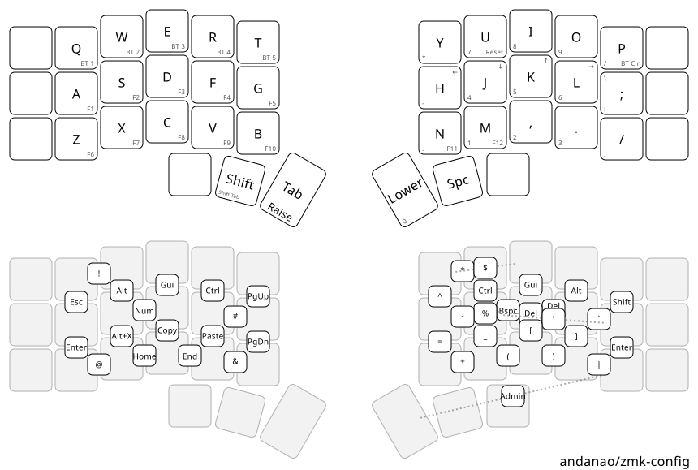
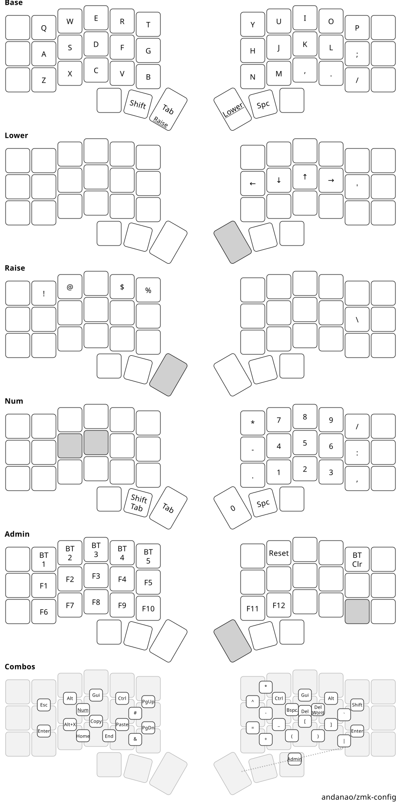
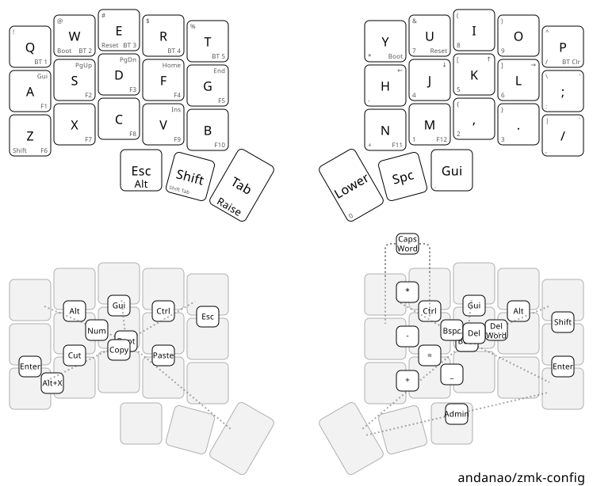

* ZMK Config
:PROPERTIES:
:ID:       e5d6c989-7bec-41a5-b37f-e9c3034b96d9
:END:

ZMK firmware for my Corne keyboards. All layers and combos live in a single 36-key
=config/base.keymap=; each board has a thin adapter that maps those onto its physical grid.

Per-layer breakdown: 

** Keyboards

| Keyboard                        | Build targets                          |
|---------------------------------+----------------------------------------|
| 6-column Corne, no display (x2) | =corne6_left= / =corne6_right=         |
| 5-column Corne with nice!view   | =corne5_view_left= / =corne5_view_right= |
| handwired 5-column Corne        | =handwired_left= / =handwired_right=   |

The three Corne PCBs share one keymap. On the 5-column board the outer-column switches simply
don't exist, so those bindings are never triggered. The handwired board has its own shield
(=config/boards/shields/handwired_corne/=) and is a true 36-key board, so it uses the shared
=base.keymap= directly with no adapter.

** Building

#+begin_src bash
just list        # show build targets
just build all   # firmware lands in firmware/
just draw        # regenerate the diagrams above
#+end_src

Pushing to GitHub builds everything through Actions, so no local setup is needed just to get a
=.uf2=. For local builds see [[file:docs/build-env.md][docs/build-env.md]]; for changing the keymap see [[file:AGENTS.md][AGENTS.md]].

** Status

Currently a 3x5+3 layout with no home-row mods. The modular structure is in place to migrate to
[[https://github.com/urob/zmk-config#timeless-homerow-mods][urob's timeless homerow mods]] when I'm
ready — see the migration notes at the end of [[file:AGENTS.md][AGENTS.md]].

Inspiration:
[[https://github.com/urob/zmk-config][urob/zmk-config]]
[[https://github.com/manna-harbour/miryoku][manna-harbour/miryoku]]

Built on [[https://github.com/urob/zmk-helpers][urob/zmk-helpers]] (which supersedes the
=zmk-nodefree-config= submodule this repo used to carry).
