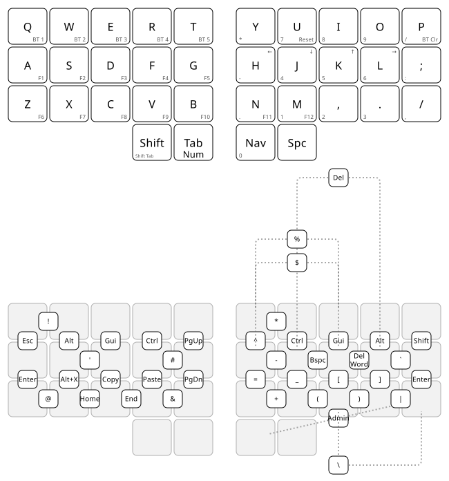
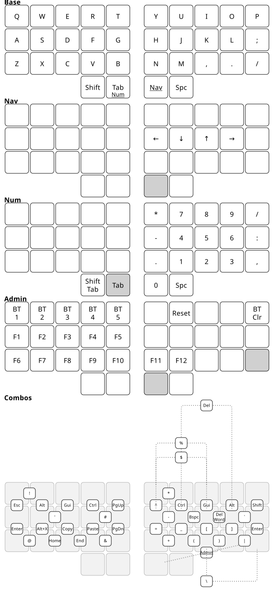

* ZMK Config
:PROPERTIES:
:ID:       e5d6c989-7bec-41a5-b37f-e9c3034b96d9
:END:

ZMK firmware for my Corne keyboards. 34 keys — 3x5 plus two thumbs a side — defined once in
=config/base.keymap= and padded out to each board's physical key count by a small adapter.

Per-layer breakdown: 

** The idea

Four layers became three and six thumbs became four, because remembering layers and coordinating a
third thumb got tiring. What absorbed the difference is combos — 43 of them, covering every
modifier, =Esc=, =Enter=, =Bspc=, =Del=, paging, and every symbol outside the numpad.

Most of them are *vertical*: two keys in one column, so one finger covers both. Typing rolls across
columns, never down them, so a vertical pair can't fire by accident — no timing to tune, no
misfires. Modifiers sit on vertical pairs mirrored on both hands, allocated by finger strength:
index =Ctrl=, middle =Gui=, ring =Alt=, pinky =Shift=.

Horizontal combos aren't free that way, so they're checked against a corpus of my own writing
before being placed — see =scripts/bigrams.py=. Anything above about 6 occurrences per 10k
characters misfires while typing.

What's left on layers is what combos are bad at: arrows, which are held and repeated, and the
numpad, which wants a whole hand.

** Keyboards

| Keyboard                        | Build targets                            |
|---------------------------------+------------------------------------------|
| 6-column Corne, no display (x2) | =corne6_left= / =corne6_right=           |
| 5-column Corne with nice!view   | =corne5_view_left= / =corne5_view_right= |
| handwired 5-column Corne        | =handwired_left= / =handwired_right=     |

All of them run the same 34 keys. The outer columns and outer thumbs are unbound — the thumbs are
physically removed. A 34-key board is next ([[file:../org/20260912220610-pocket_keyboard.org][Pocket Keyboard]]), which is what the layout is
really aimed at.

The three Corne PCBs share =config/corne.keymap=; the handwired one has its own shield under
=config/boards/shields/handwired_corne/=.

** Building

#+begin_src bash
just list        # show build targets
just build all   # firmware lands in firmware/
just flash corne5_view   # build and flash the left half
just draw        # regenerate the diagrams above
#+end_src

Pushing to GitHub builds everything through Actions, so no local setup is needed just to get a
=.uf2=. For local builds see [[file:docs/build-env.md][docs/build-env.md]]; for changing the keymap see [[file:AGENTS.md][AGENTS.md]].

Inspiration: [[https://github.com/urob/zmk-config][urob/zmk-config]], built on [[https://github.com/urob/zmk-helpers][urob/zmk-helpers]].
